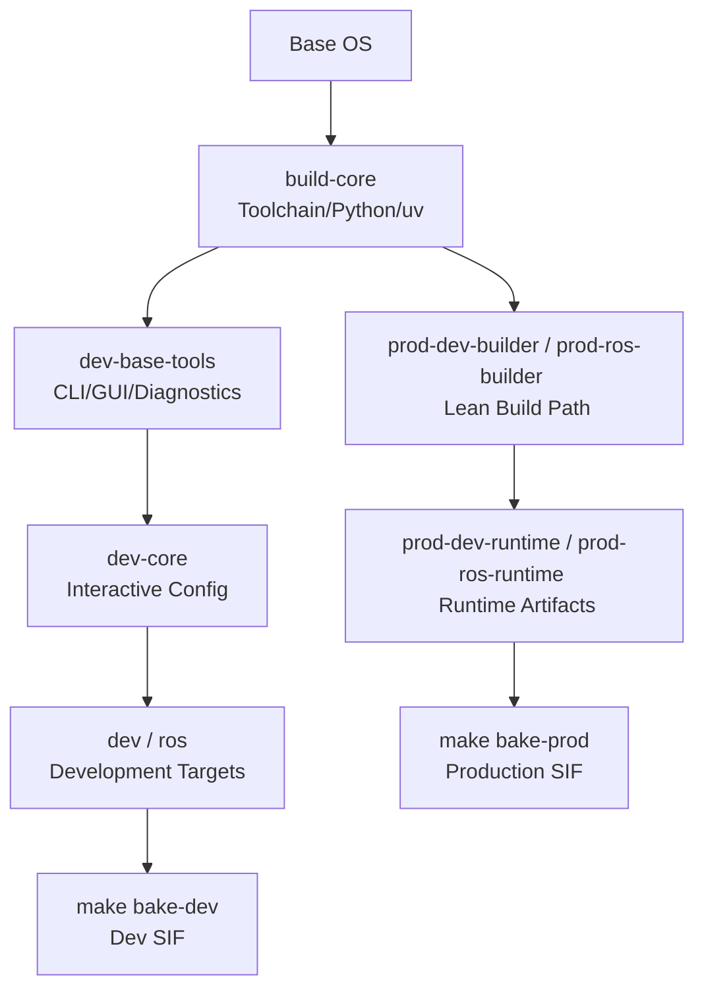
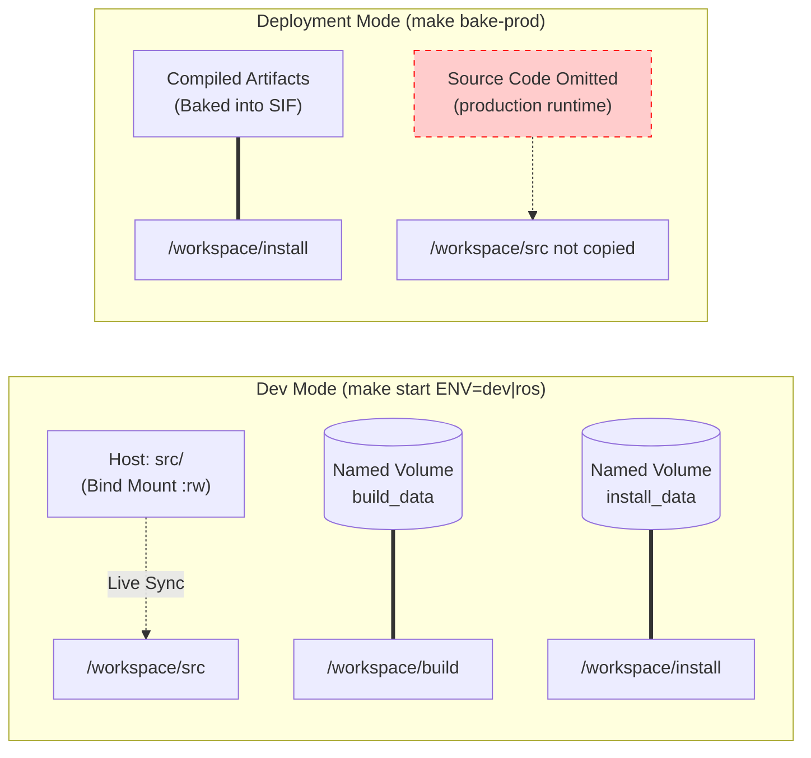
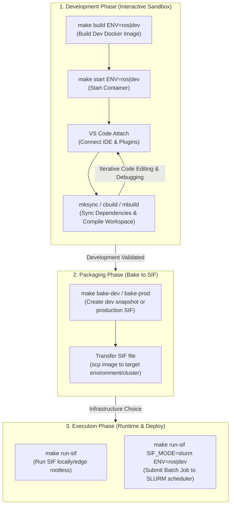
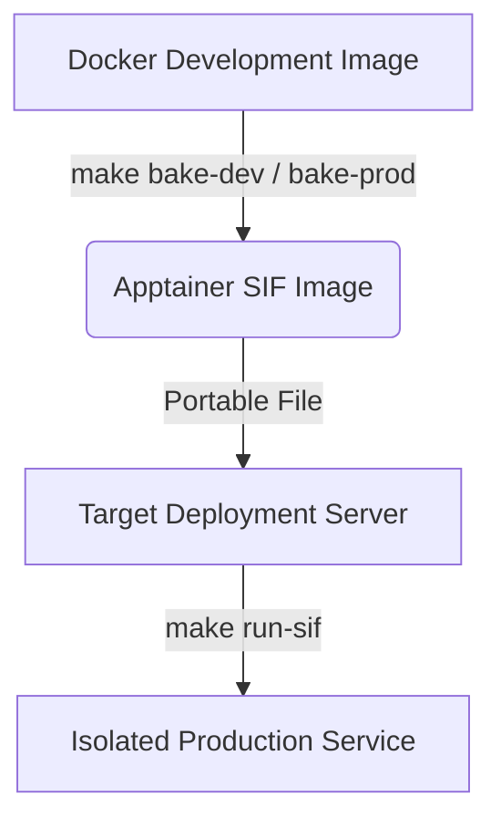
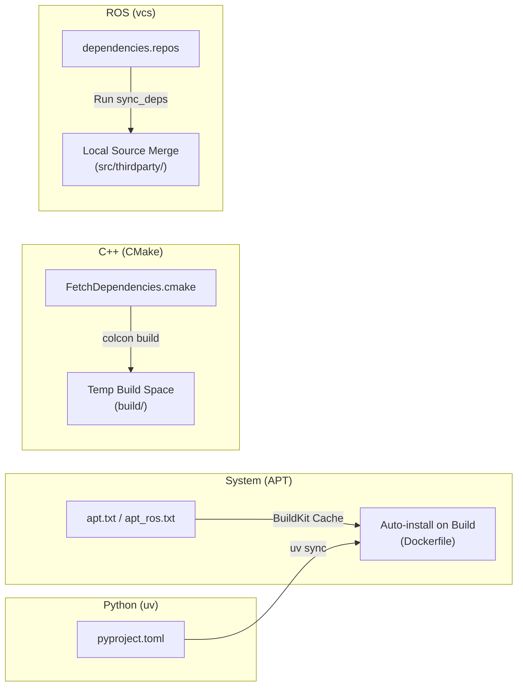

<!-- markdownlint-disable MD041 -->
<!-- markdownlint-disable MD033 -->

<p align="center">
  
</p>

<h1 align="center">All-in-One Docker DevKit</h1>

<p align="center">
  <a href="README.md">English</a> | <a href="README.ko.md">한국어</a>
</p>

<p align="center">
  
  
  
  
  
</p>

<p align="center">
  This repository provides an <b>isolated development environment template</b> designed to enable seamless <b>C++, Python(uv), and ROS 1 / ROS 2</b> development without polluting your host system. Start developing immediately across any project without complex configurations.
</p>

## 💡 Core Values

- **Zero-Pollution Isolation**: Only install Docker on your host machine. All libraries and dependencies are entirely managed by lightweight containers to prevent system conflicts.
- **Hardware Agnostic**: Auto-detects NVIDIA, Intel, and AMD GPUs. Provides instant hardware acceleration on both **X11 and modern Wayland environments**.
- **Production Ready**: Bakes validated development artifacts into portable **Apptainer SIF** images, complete with built-in **automatic dependency verification (Sanity Check)**.
- **Unified Workspace**: Every project follows an identical directory structure (`src`, `build`, `install`), drastically improving team collaboration and long-term maintainability.

## 🌟 Key Features

- **Intelligent Diagnostic Engine**: Running `make status` identifies the host's GPU architecture, CPU architecture (AMD64/ARM64), display protocols, and **Wayland socket paths** to automatically orchestrate the optimal runtime environment.
- **Unified Workspace (Everything is a Package)**: All projects (C++, Python, ROS) adhere to the standard **`src/` (Source), `build/` (Build), and `install/` (Artifacts)** structure, maximizing consistency between development and deployment workflows.
- **APT Snapshot Reproducibility**: Improves package-level reproducibility by pinning APT indexes with `APT_SNAPSHOT_DATE`. Set a UTC date from `date -u +%Y%m%dT%H%M%SZ` in `.env` to rebuild against the same Ubuntu package snapshot.
- **Runtime Dependency Guardian (Sanity Check)**: During artifact validation, it inspects executables and libraries for missing dependencies using `ldd`, helping prevent 'Shared library not found' errors at runtime.
- **Portable & Secure Deployments (Apptainer SIF)**: Production deployment is packaged as a single SIF artifact for rootless execution on edge systems and HPC clusters.
- **Multi-Arch Build Support**: Runs with native performance of the underlying CPU across both x86 (Intel/AMD) and ARM64 (Jetson, Apple Silicon) environments without translation overhead using a single Dockerfile.
- **Consistent Permission System**: Dynamically maps the host user's UID and GID to a non-root developer user inside the container at build/run time, ensuring seamless file ownership compatibility between the host and container.
- **Sudo-Free Cleanup**: Uses a disposable container for host-side artifact deletion during `make clean`, avoiding `sudo` while keeping failures visible instead of silently hiding incomplete cleanup.
- **Sidecar Architecture**: Maintain a lightweight development image while instantly "attaching" a high-performance environment on-demand.
- **CI/CD Robustness**: Includes a `FORCE=1` flag that bypasses interactive prompts, combined with auto-detection for `CI=true`, so cleanup and setup commands can run non-interactively in pipelines.

---

## 🎯 Architecture Philosophy & Technical Positioning

DevKit is designed to be more than just a virtualization tool; it serves as a **comprehensive architecture template** that manages the entire lifecycle of your project.

While many existing tools focus primarily on container isolation or support only a single framework, DevKit fully integrates **ROS & General C++/Python Development, Multi-GPU pass-through, and Production Deployment pipelines** into a cohesive system. Notably, it pursues a **modular architecture** that decouples project-specific requirements (e.g., simulators, databases) into sidecar containers, maintaining the purity of the core development environment while maximizing flexibility for hardware transitions.

> ※ SIF Bake: A strategy where the validated workspace is baked into a single portable Apptainer image for local, edge, or cluster execution.

| System | ROS Specific | Auto GPU Detect | Multi-Architecture (x86/ARM) | Reproducibility | Production Ready | Barrier to Entry |
| --- | --- | --- | --- | --- | --- | --- |
| **DevKit** | Yes (Includes pure C++/Python) | Yes (NVIDIA/Intel/AMD) | Yes (OS Native) | Pinned (APT Snapshot) | Yes (Apptainer SIF) | Low |
| VS Code Dev Containers | No (General focus) | No | Yes (Universal) | Moderate | No | Low |
| Rocker | Yes | Yes (NVIDIA/Intel) | Yes (Docker-based) | No | No | Low |
| NVIDIA Isaac ROS | Yes | NVIDIA Only | No (Jetson/x86 Only) | Image-pinned | Yes | Medium |
| ADE (Apex.AI) | Yes (Autoware focus) | Manual Setup | Yes (Universal) | Moderate | No | Medium |
| RoboStack (Conda) | Yes | No (Dependency-based) | Yes (OS-dependent) | Moderate (Conda-bound) | No | Low |
| Distrobox / Toolbx | No | Yes (Host resources) | Yes (Host kernel) | No (Host-dependent) | No | Low |
| Singularity (Apptainer) | No | Yes (NVIDIA/AMD opts) | Yes (Universal) | High (Single image) | Yes (HPC focus) | High |
| Nix / NixOS Flakes | Difficult | Manual Setup | Yes (Cross-build) | Extreme (OS Level Pinned) | Yes | Very High |
| Earthly | No | Manual Setup | Yes (Universal) | Moderate (Build isolated) | No (Builder focus) | Medium |

> **Note:** Bazel is excluded from the table as it functions primarily as a build automation tool rather than a containerized development environment, though it is discussed in the detailed comparison below.

<!-- markdownlint-disable MD033 -->
<details>
<summary><b>🔍 Detailed Systems Comparison (Click to expand)</b></summary>

### 1. VS Code Dev Containers (Microsoft)

- **Similarities**: Provides container-based isolated environments via `devcontainer.json`.
- **Pros**: Native integration with VS Code and GitHub Codespaces; rich community templates.
- **Cons**: Lacks auto GPU detection; missing ROS-specific workflows; no built-in production deployment strategy.

### 2. Rocker (Open Robotics)

- **Similarities**: Supports NVIDIA/Intel GPU and X11/Wayland pass-through natively for ROS container development.
- **Pros**: The mature, widely-adopted standard in the ROS ecosystem; solid plugin architecture.
- **Cons**: Does not enforce project workspace structures; lacks strict reproducibility guarantees (like APT snapshots); no pipeline for creating production images (Bake).

### 3. NVIDIA Isaac ROS

- **Similarities**: Containerized ROS 2 + GPU development environments.
- **Pros**: Maximizes hardware optimization specifically for NVIDIA; native cuVS/CUDA library integration.
- **Cons**: Locked strictly to the NVIDIA ecosystem (Cannot support AMD/Intel); limited open-source customizability.

### 4. Bazel (Google)

- **Similarities**: Strives for absolute reproducibility through tightly controlled dependencies and build environments.
- **Pros**: Unmatched caching performance for massive monorepos; achieves pure hermetic builds.
- **Cons**: Extreme friction when integrating with ROS, multi-GPU targets, and modern Python stacks (like `uv`); requires migrating standard CMake/colcon ecosystem packages into rigid `BUILD` files, leading to astronomical maintenance overhead. (Calculated primarily as a build automation tool, not an interactive host dev-environment multiplexer).

### 5. Nix / NixOS Flakes

- **Similarities**: Ensures pure reproducibility by strictly pinning package versions.
- **Pros**: Delivers OS-level reproducibility independent of Docker; extreme dependency determinism.
- **Cons**: Extremely steep learning curve (functional package management); convoluted to configure for ROS/GPU stacks; high team onboarding friction.

### 6. Earthly

- **Similarities**: Unifies Makefile + Dockerfile concepts for build orchestration.
- **Pros**: Superior for CI/CD pipeline integration and concurrent compilation caching.
- **Cons**: Centered around CI build automation rather than acting as a daily interactive environment with display/GPU pass-through and live bash shells.

### 7. ADE (Agile Development Environment by Apex.AI)

- **Similarities**: Container-based development environment tool explicitly specialized for the ROS (primarily Autoware) ecosystem.
- **Pros**: Optimized for orchestrating and overlaying volumes across multiple cascaded Docker images (e.g., Base, System, User).
- **Cons**: The multi-layered image architecture can introduce overhead for lightweight single projects; primarily focuses on local development convenience rather than building lean production pipelines.

### 8. RoboStack (Conda)

- **Similarities**: Provides streamlined installation of ROS 1/2 environments into local systems.
- **Pros**: Installs and runs ROS securely using OS-independent `conda` environments on macOS or Windows without requiring Docker containerization.
- **Cons**: Lacks true system-level isolation, exposing projects to host OS package conflicts; disconnected from strict container-based production deployment workflows.

### 9. Distrobox / Toolbx

- **Similarities**: Provides containerized Linux development environments on top of the host OS.
- **Pros**: Magically integrates with the host by inherently sharing the home directory, X11/Wayland, audio, and USBs rootlessly, acting indistinguishably from a native machine.
- **Cons**: The intense coupling to the host intentionally sacrifices "pure isolation and reproducibility"; lacks project-level artifact separation and ROS-centric workflow convenience.

### 10. Singularity / Apptainer

- **Similarities**: High-performance isolated container solution serving as a Docker alternative.
- **Pros**: Inherently rootless architecture makes it the gold standard for academic labs and HPC clusters navigating strict security paradigms.
- **Cons**: The ecosystem is deeply slanted towards scientific computing, making desktop-tier dev usability (like strict GUI pass-through) tedious; establishes a steeper learning curve for standard software engineers.

</details>
<!-- markdownlint-enable MD033 -->

---

## 🏗 Multi-stage Docker Architecture

This template utilizes a granular container build pipeline to maximize speed and cache efficiency.



---

## 🚀 Standard Workspace Layout

Every project adheres to this layout, regardless of the underlying language or framework.

- **`src/`**: All source code and build configurations (CMakeLists.txt, pyproject.toml, etc.)
- **`build/`**: Temporary build space utilized by compilers and build systems.
- **`install/`**: The **deployment artifacts** directory where final executables, libraries, and Python virtual environments (`.venv`) are stored.
  - *Note: The Python virtual environment is intentionally placed inside `install/` so it can be executed independently without the source code upon deployment. For IDE compatibility, a `.venv` symlink is automatically created in the project root.*



---

## 🔄 Development Lifecycle

The diagram below maps the typical developer workflow from building the sandbox environment to compiling workspace packages, packaging artifacts, and deploying to production:



---

## 🚀 Quick Start Guide

### 1. Copy Template and Initialize Project

Create an isolated new project folder on your host machine and inject the template files (Or use the **Use this template** button on GitHub).

```bash
# Copy template
mkdir -p /path/to/my_new_project
cp -r /path/to/project_template/* /path/to/my_new_project/
cp -r /path/to/project_template/.[!.]* /path/to/my_new_project/

cd /path/to/my_new_project
```

### 2. Configure Environment Variables (Core ⭐️)

Run `make setup` to generate the `.env` file, which is used to configure your isolated project environment.

```bash
make setup
nano .env
```

Within the `.env` file, **select a matching `BASE_IMAGE` and `ROS_DISTRO` pair** and modify the following values:

```ini
COMPOSE_PROJECT_NAME=my_new_project         # Unique Docker resource identifier (Must be changed)

# HOST_WORKSPACE_PATH=/home/user/DevKit     # Host project path (Optional, Default: current directory)
# WORKSPACE_PATH=/workspace                 # Container workspace path (Optional)

# ROS 2 (Default)
BASE_IMAGE=ubuntu:22.04
ROS_DISTRO=humble

# ROS 1 (Noetic)
# BASE_IMAGE=ubuntu:20.04
# ROS_DISTRO=noetic
```

### 3. SSH Host Key Security Configuration (Optional)

To enable seamless communication with Git servers from inside the Docker container, ensure your host's private key permissions correspond correctly.

```bash
# Execute on the Host PC
chmod 600 ~/.ssh/id_rsa  # or id_ed25519
```

### 4. Start Development Environment and Check Status

```bash
make status         # Auto-detect current project configuration, GPU, Architecture, and Toolkit
make build ENV=ros  # Build ROS image (Automatic Multi-Arch support)
make start ENV=ros  # Start the ROS container (Auto-detects GPU)
make shell ENV=ros  # Enter the ROS container
# OR
make build ENV=dev  # Build pure C++/Python image
make start ENV=dev  # Start pure C++/Python container (Auto-detects GPU)
```

---

---

## 📑 System Infrastructure Requirements

DevKit is built upon the architectural philosophies of **"Zero-Pollution"** and **"Unified Orchestration."** To achieve these, every host environment requires the following **Core Infrastructure Trinity**.

### 🎯 Core Infrastructure Stack

| Component | Role | Architectural Rationale |
| :--- | :---: | :--- |
| **Docker Engine** | **Runtime & Isolation** | Encapsulates all development tools and dependencies within isolated containers. |
| **GNU Make** | **Command Center** | Abstract and automates complex Docker operations into a unified workflow (e.g., `make start ENV=ros`). |
| **NVIDIA Toolkit** | **HW Acceleration** | Provides seamless hardware passthrough of host GPU resources into the container. |

---

### 📊 Implementation Matrix

The method for implementing the core stack varies based on your Host OS. Select the path that corresponds to your environment.

| Category | 🐧 Native Linux (Ubuntu, etc.) | 🪟 Windows (WSL 2) |
| :--- | :--- | :--- |
| **Recommended** | **Native Docker Engine** | **Native Docker (Option B)** |
| **Docker Install** | Native installation via `apt-get` | Direct installation inside WSL 2 (Systemd required) |
| **Make Install** | `sudo apt install make` | `sudo apt install make` (Inside WSL 2) |
| **GPU Support** | `nvidia-container-toolkit` | Windows NVIDIA Driver + Toolkit |
| **Permissions** | `docker` group membership required | `docker` group membership required (for Option B) |
| **Critical Notes** | Highest native performance | **IO Performance**: Use `~/`, NOT `/mnt/c/` |

---

### 🛠 Detailed Setup Guide

#### 1. Common Installation: Docker Engine & NVIDIA Toolkit (Native)

Standard procedure for **Native Linux** and **WSL 2 (Option B)** users.

```bash
# A. Install Docker Engine (Official Repo)
## 1) Remove Existing Docker (To prevent conflicts)
sudo apt remove $(dpkg --get-selections docker.io docker-compose docker-compose-v2 docker-doc podman-docker containerd runc | cut -f1)
## 2) Add Docker Official Repository
sudo apt update
sudo apt install ca-certificates curl
sudo install -m 0755 -d /etc/apt/keyrings
sudo curl -fsSL https://download.docker.com/linux/ubuntu/gpg -o /etc/apt/keyrings/docker.asc
sudo chmod a+r /etc/apt/keyrings/docker.asc
sudo tee /etc/apt/sources.list.d/docker.sources <<EOF
Types: deb
URIs: https://download.docker.com/linux/ubuntu
Suites: $(. /etc/os-release && echo "${UBUNTU_CODENAME:-$VERSION_CODENAME}")
Components: stable
Architectures: $(dpkg --print-architecture)
Signed-By: /etc/apt/keyrings/docker.asc
EOF
## 3) Docker Install
sudo apt update
sudo apt install docker-ce docker-ce-cli containerd.io docker-buildx-plugin docker-compose-plugin

# B. Install NVIDIA Container Toolkit
sudo apt-get update && sudo apt-get install -y --no-install-recommends ca-certificates curl gnupg2
## 1) Add NVIDIA Official Repository
curl -fsSL https://nvidia.github.io/libnvidia-container/gpgkey | sudo gpg --dearmor -o /usr/share/keyrings/nvidia-container-toolkit-keyring.gpg \
  && curl -s -L https://nvidia.github.io/libnvidia-container/stable/deb/nvidia-container-toolkit.list | \
  sed 's#deb https://#deb [signed-by=/usr/share/keyrings/nvidia-container-toolkit-keyring.gpg] https://#g' | \
  sudo tee /etc/apt/sources.list.d/nvidia-container-toolkit.list
sudo apt-get update
## 2) Install NVIDIA Container Toolkit
export NVIDIA_CONTAINER_TOOLKIT_VERSION=1.19.0-1
sudo apt-get install -y \
  nvidia-container-toolkit=${NVIDIA_CONTAINER_TOOLKIT_VERSION} \
  nvidia-container-toolkit-base=${NVIDIA_CONTAINER_TOOLKIT_VERSION} \
  libnvidia-container-tools=${NVIDIA_CONTAINER_TOOLKIT_VERSION} \
  libnvidia-container1=${NVIDIA_CONTAINER_TOOLKIT_VERSION}
## 3) NVIDIA Runtime Configuration & Service Restart
sudo nvidia-ctk runtime configure --runtime=docker
### If using Systemd
sudo systemctl restart docker
### If not using Systemd
sudo service docker restart

# C. Permission Setting & Verification
## Add current user to docker group (To use without sudo)
sudo usermod -aG docker $USER
## Apply group permissions immediately to the current terminal
newgrp docker
## Verify Docker and GPU recognition
docker ps
nvidia-smi
```

#### 2. WSL 2 Specific Configuration

- **Project File Location**:
  - **Recommended**: `\\wsl$\Ubuntu\home\username\my_project`
  - **Discouraged**: `C:\Users\username\my_project` (I/O speed will be significantly degraded.)
- **Enable Systemd**: Add `[boot]\nsystemd=true` to `/etc/wsl.conf` inside WSL and run `wsl --shutdown` in PowerShell.
- **GUI & Graphics Acceleration**
  - **Windows 11**: GUI ROS tools such as `rviz2` run natively without extra configuration (WSLg support). Add Gazebo to `dependencies/apt_ros.txt` only when a project needs simulation.
  - **Windows 10**: You may need to install an X Server like VcXsrv.
- **Networking Mode (ROS 2 Multicast)**: To communicate with hardware or robots on the local network, **Mirrored Networking Mode** is highly recommended.
  1. Create or edit `%USERPROFILE%\.wslconfig` on Windows.
  2. Add the following configuration:

   ```ini
   [wsl2]
   networkingMode=mirrored
   ```

  3. Restart WSL: Run `wsl --shutdown` in PowerShell and restart your terminal.

- **GPU Acceleration & Hardware Alignment (Optimization) 🚀**
  WSL 2 may prioritize your integrated GPU (iGPU) or fallback to a software renderer (`llvmpipe`) when both an iGPU and a discrete NVIDIA GPU are present, resulting in poor performance. To resolve this, add the appropriate settings for your hardware to your host Linux (WSL) `~/.bashrc`.

  **1. Auto-Diagnosis**: Run `make status` on your host terminal and check for any `WSL GPU Acceleration Audit` warnings. If no warnings appear, your system is already optimized.

  **1.1 Manual Verification (Optional)**: You can manually check the status on your HOST(WSL) terminal:
  - **Check Renderer**: `glxinfo -B | grep "OpenGL renderer"`
    - If you see `llvmpipe`, the system is using software rendering.
    - You should see `D3D12` or `NVIDIA` for hardware acceleration.
  - **Check NVIDIA Status**: `nvidia-smi` (For NVIDIA users)

  **2. Hardware-Specific Setup (Add to HOST(WSL) ~/.bashrc)**:
  - **Case A: Using Discrete NVIDIA GPU (dGPU) - Recommended**

    ```bash
    export MESA_LOADER_DRIVER_OVERRIDE=d3d12
    export GALLIUM_DRIVER=d3d12
    export MESA_D3D12_DEFAULT_ADAPTER_NAME=NVIDIA
    ```

  - **Case B: Using Integrated Intel/AMD GPU (iGPU) Only**

    ```bash
    export MESA_LOADER_DRIVER_OVERRIDE=d3d12
    export GALLIUM_DRIVER=d3d12
    ```

  **3. Environment Variable Details**:
  - `MESA_LOADER_DRIVER_OVERRIDE=d3d12`: Forces the Mesa driver to use the WSL2-specific D3D12 bridge.
  - `GALLIUM_DRIVER=d3d12`: Pins the graphics pipeline backend to D3D12.
  - `MESA_D3D12_DEFAULT_ADAPTER_NAME=NVIDIA`: Explicitly selects the NVIDIA GPU in multi-GPU environments instead of the lower-performance integrated graphics. (Essential if your host has an NVIDIA GPU)

---

## 💻 Running the Environment and GPU Modes

The system automatically selects the optimal hardware mode for your workstation.

| Environment | Run (Auto GPU Detect) | Stop | Restart | Enter Shell | Open New Window (GUI) |
| :--- | :--- | :--- | :--- | :--- | :--- |
| **ROS Env** | **`make start ENV=ros`** | **`make stop ENV=ros`** | **`make restart ENV=ros`** | **`make shell ENV=ros`** | **`make term ENV=ros`** |
| **Pure Dev** | **`make start ENV=dev`** | **`make stop ENV=dev`** | **`make restart ENV=dev`** | **`make shell ENV=dev`** | **`make term ENV=dev`** |

> **Tip:** You can use `make status` to verify if the current system accurately recognizes an NVIDIA GPU and the Container Toolkit, and to confirm the active architecture (AMD64/ARM64).

---

## 🔌 VS Code (IDE) Integration Guide (IDE Integration)

To seamlessly connect your host development editor (VS Code) with the powerful isolated build engine inside the container, **DevKit** strongly recommends the **"Start Container First, then VS Code Attach"** workflow.

Instead of spawning a heavy container directly from the editor, this robotics/HPC industry-standard workflow allows you to launch the optimal container service tailored to your hardware layout (GPU/iGPU, etc.) via the terminal first, and then attach your VS Code editor engine as a lightweight client on top.

### 🏁 Recommended Workflow

1. **Start the Container Service via Host Terminal**:
   Launch the container service matching your current project focus and hardware layout:

   ```bash
   make start ENV=ros  # Launches the ROS environment (Auto-detects GPU and runs persistently in background)
   # OR
   make start ENV=dev  # Launches the general C++/Python development target
   ```

2. **Attach VS Code to the Running Container**:
   - Launch VS Code on your host machine.
   - Press **`F1`** (or `Ctrl+Shift+P`) to open the Command Palette.
   - Search for and select **`Dev Containers: Attach to Running Container...`**.
   - Select your active project container (e.g., `devkit-ros-nvidia` or similar) from the dropdown list.

3. **Develop & Code Natively**:
   - Once connected, VS Code Server is automatically installed inside the container, and the pre-configured C++ and ROS extensions (IntelliSense, CMake Tools, ROS, etc.) defined in `.devcontainer/devcontainer.json` will instantly activate.
   - Open the `/workspace` folder and start developing with native-grade autocomplete and symbols navigation!

---

## 🛠 In-Container Development Workflow

Experience a consistent UX across any project using standard aliases and shortcuts after connecting.

### 🏁 First Setup & Initialization Scenario

If you've entered the container shell for the first time, perform the following initialization. Since development environments are orchestrated on-demand, these initial setup steps are required.

```bash
# 1. 🚀 One-step Unified Initialization (Highly Recommended)
mksync            # Automatically runs mkenv + uvs + sync_deps + Intelligent Build (cbuild/mbuild)
# mksync --share  # Use this if you need system-site-packages (e.g., for system ROS/OpenCV bindings)
# mksync --extra gpu --locked  # Forward uv sync options through the one-step flow

# --- OR manually perform step-by-step ---

# 1. 🐍 Create Python virtual environment and download dependencies
mkenv             # Create /workspace/install/.venv and root symlink
uvs               # Lightning-fast dependency installation via pyproject.toml (uv sync)
# uvp -r dependencies/requirements.txt  # (Alternative) For standard requirements.txt users

# 2. 📦 Download ROS and C++ Third-party Dependencies
sync_deps         # Clone dependencies.repos and auto-install rosdep system packages

# 3. 🔨 Orchestrate Source Code Build
cbuild            # ROS: Execute colcon build
mbuild            # Pure C++: Execute modern CMake build & install
mclean            # Clean Build: Remove build and install artifacts
```

`ROS_DISTRO=noetic` automatically uses a shared system-site-packages venv so ROS 1 Python bindings such as `rospy` remain visible.
`sync_deps` fails fast on `vcs import`/`vcs pull` errors, and `sync_deps --rosdep` fails fast on unresolved system packages. Use `DEVKIT_VCS_ALLOW_FAILURE=1` or `DEVKIT_ROSDEP_ALLOW_FAILURE=1` only when continuing is intentional.

### 📋 Unified Command Dictionary

| Command | Description | Action |
| :--- | :--- | :--- |
| **`h` / `help`** | **Shortcut Guide** | Print a full list of available Aliases and Utility usages |
| **`mksync`** | **Unified Init** | **One-step automation**: mkenv + uvs + sync_deps + Build |
| **`hw_check`** | Hardware Diagnostics | Check GPU acceleration, **XWayland/Wayland availability**, and detailed renderer diagnostics |
| **`mbuild`** | **Standard C++ Build** | Build `src/` source code and install it to the `install/` directory |
| **`mclean`** | **Clean Build** | Surgical removal of `build/` and `install/` artifacts |
| **`mkenv`** | **Create Python venv** | **Auto-create directory** and attach a root symlink for the `install/.venv` path |
| **`cbuild`** | **ROS Build** | Build `src/` source code and install it to the `install/` directory |
| **`sync_deps`** | Sync Dependencies | Synchronize external repositories based on `.repos` and merge them into the `src/thirdparty` workspace |
| **`check_deps`** | Sanity Check | Verify missing shared libraries (`*.so`) inside `install/` |

### 💡 Common Aliases

| Category | Alias | Description | Function |
| :--- | :--- | :--- |
| **Workflow** | `mksync` | One-step Init | Automatically detects project type and orchestrates full setup |
| | `mksync --share` | Shared Env Init | Init with system-site-packages enabled; Noetic enables this automatically |
| **ROS Build** | `cbuild` / `cbuild --release` | Colcon Build | Build with `RelWithDebInfo` / `Release` profile |
| | `cbuild --pkg <name...>`, `cbt --pkg <name...>`, `cbtr` | Target Package / Test / Results | `--packages-select`, `colcon test`, `colcon test-result` |
| **C++ Build** | `mbuild` / `mclean` | Modern CMake Build | Build & Install / Surgical Clean |
| | `s` | Source Workspace | `source install/setup.bash` |
| **Python** | `activate` | Activate venv | `source install/.venv/bin/activate` |
| | `uvs`, `uvr` | uv commands | `uv sync`, `uv run` |
| | `pyv` / `pyt` | Deep Diagnostic | Detailed Python env status / PyTorch & CUDA check |
| **GPU/HW** | `gpu status` | GPU Status Summary | Check current renderer and hardware acceleration status |
| | `gpu auto` | Auto-detect GPU | Rescan hardware layout and reset system environment variables |
| | `vulkan_check` | Check Vulkan API | Print `vulkaninfo` hardware summary |
| **Utils** | `k` / `k9` | Terminate Process | Graceful kill (`killall`) / Force kill (`-9`) |
| **Nav** | `cw`, `cs`, `cc` | Move Directory | Traverse to `/workspace`, `/workspace/src`, or `/workspace/config` |

> 💡 **Advanced Tip: Bash Completion & Automation**
> - **Tab Completion**: All custom commands (`mksync`, `mkenv`, `gpu`, etc.) and ROS packages (for `cbuild --pkg`) support rich Bash tab-completion.
> - **Host Make Completion**: Run `make completion-install` once on the host to enable Tab completion for DevKit `make` targets and common variables like `ENV=`, `SIF_MODE=`, and `SIF_FILE=`.
> - **CI/CD Integration**: Development aliases are integrated into the entrypoint, making them available in non-interactive sessions like `docker exec` and CI pipelines.

---

## 🧹 Maintenance and Cleanup Commands

Utilize these integrated tasks from your host terminal to manage the project lifecycle.

| Command | Description | Action |
| :--- | :--- | :--- |
| **`make stats`** | **Resource Monitoring** | Monitor overall CPU/Memory usage across all containers and check the status of **all GPUs (NVIDIA/Intel/AMD)** |
| **`make top`** | **Detailed Monitoring** | Detailed status of CPU utilization per core mapping and comprehensive **GPU processes (NVIDIA/Intel/AMD)** tracking |
| **`make status`** | Project Status Summary | Print whether containers are actively running, display **Diagnostic engine results**, and general layout |
| **`make completion-install`** | Host Shell Completion | Install Bash completion for DevKit `make` targets and common variables |
| **`make check-host`** | Pre-check Host Env | Prevent build errors by analyzing the GPU driver layout and X11 permission structure beforehand |
| **`make logs`** | Real-time Log Streaming | Interface with the real-time output of currently running containers (Ctrl+C to exit) |
| **`make down`** | Stop Services | Safely suspend and remove all active containers linked to the current project |
| **`make clean`** | Delete Build Artifacts | Flush build, install, log directories inside **`/workspace`** alongside temporary volumes |
| **`make clean-cache`** | Flush Compile Cache | Safely delete the host cache directory (`.docker_cache` by default); refuses relative/root/workspace-root paths and warns before deleting shared global caches |
| **`make clean-all`** | **Project Reset** | Completely tear down **all images, volumes, and host caches** strictly tied to the project |
| **`make docker-clean`** | **Docker System Cleanup** | Purge entire system build caches and orphaned unused images (Global Reset) |
| **`make env-check`** | **Check Env Variables** | Auto-inspect for structural discrepancies of `.env` configurations against `.env.example` |
| **`make verify`** | **Repository Validation** | Run fast checks for shell syntax, Dockerfile, Compose config, env sync, and package filters |

> `make verify` runs Docker checks by default. Use `make verify VERIFY_DOCKER=0` for script-only validation when Docker socket access is unavailable.

> 💡 **Tip (Non-interactive Force Execution and CI Mode)**
> To fundamentally prevent data loss, the `clean` series commands require deletion consent (`[Y/N]`) by default.
> To bypass this restriction dynamically or inject it into an automated shell script, append the `FORCE=1` argument like **`make clean FORCE=1`**.
> (※ On automation platforms like GitHub Actions or GitLab CI, the `CI=true` environment variable is automatically detected, bypassing redundant prompts without requiring script modification!)

---

## 🧊 Apptainer Workflow (Production & Portability)

The DevKit leverages **Apptainer (formerly Singularity)** as the primary strategy for production deployment and portability across high-performance computing (HPC) clusters and edge devices.



### 1. Why Apptainer for Production?

- **Single File Portability**: The entire workspace (build, install, venv) is "baked" into a single `.sif` file.
- **Rootless Execution**: Runs securely on shared clusters (HPC) without requiring root/sudo privileges.
- **Environment Snapshots**: Captures the exact state of your development environment, ensuring "it works on my machine" translates to the field.

### 2. Core Commands

| Category | Execute Command | Action |
| :--- | :--- | :--- |
| **Bake Dev Snapshot** | **`make bake-dev ENV=ros|dev`** | Internalizes the selected workspace into a dev SIF image (isolated Python venv) |
| **Bake Dev Shared** | **`make bake-dev ENV=ros|dev SHARE=1`** | Bake a dev SIF sharing system site-packages |
| **Bake Production** | **`make bake-prod ENV=ros|dev`** | Bake a user-facing production SIF from `install/` and runtime dependencies only |
| **Run Dev SIF** | **`make run-sif SIF_MODE=dev`** | Run the dev SIF locally with host workspace shadow bind |
| **Run Dev Shared SIF** | **`make run-sif SIF_MODE=dev SHARE=1`** | Run the shared dev SIF created with `SHARE=1` |
| **Run Production SIF** | **`make run-sif SIF_MODE=prod ENV=ros|dev`** | Run the selected production SIF without source bind |
| **Run SLURM** | **`make run-sif SIF_MODE=slurm ENV=ros|dev`** | Submit the selected production SIF to SLURM |
| **SLURM Status** | **`make slurm-status`** | Query active/pending SLURM jobs of the current user |
| **SLURM Cancel** | **`make slurm-cancel`** | Cancel running/pending SLURM jobs |

Default SIF names include both the selected environment and image mode: `myproject_ros_dev_latest.sif`, `myproject_dev_dev-share_latest.sif`, and `myproject_ros_prod_latest.sif`. Set `SIF_FILE=...` to override the generated name.

For reproducible release metadata, set `SOURCE_DATE_EPOCH` before baking, for example `SOURCE_DATE_EPOCH=$(git log -1 --format=%ct) make bake-prod ENV=ros`.

Use `DEVKIT_DRY_RUN=1` with `make bake-dev`, `make bake-prod`, or `make run-sif` to validate the planned Docker/SIF/SLURM operation without building, submitting, or executing the image.

### 3. Deployment Guide

```bash
# 1. Bake the workspace into a production SIF image
make bake-prod ENV=ros
# Optional: include the complete CUDA toolkit for GPU-heavy target servers
PROD_FULL_CUDA=1 make bake-prod ENV=ros

# 2. Transfer the .sif file to the target server
scp myproject_ros_prod_latest.sif user@target:/path/to/project/

# 3. Run the service natively on the target host
APP_COMMAND='python3 -V' make run-sif SIF_MODE=prod ENV=ros
# Or pass an explicit command directly
make run-sif SIF_MODE=prod ENV=ros RUN_ARGS='python3 -V'
# OR submit as a batch job to the SLURM scheduler
make run-sif SIF_MODE=slurm ENV=ros RUN_ARGS='python3 -V'
```

Use `RUN_ARGS` for simple argv-style commands. Prefer `APP_COMMAND` or `ROS_LAUNCH_COMMAND` for complex shell expressions with pipes, redirects, or nested quoting.

SLURM submissions print the requested job resources and exact `sbatch` options before submission, then the job log prints the actual allocated job ID, node list, tasks, CPUs, GPUs, logs, project root, and embedded image workspace. Production SIFs do not bind the source tree; optional runtime mounts can be configured with:

```bash
DEVKIT_SLURM_JOB_NAME=devkit
DEVKIT_SLURM_PARTITION=local
DEVKIT_SLURM_NODES=1
DEVKIT_SLURM_NTASKS=1
DEVKIT_SLURM_CPUS_PER_TASK=4
DEVKIT_SLURM_GRES=gpu:1
DEVKIT_SLURM_TIME=00:30:00
DEVKIT_SLURM_OUTPUT=logs/%x_%j.out
DEVKIT_SLURM_ERROR=logs/%x_%j.err
DEVKIT_SLURM_COMMENT=submitter:devkit
SLURM_DATA_ROOT=/path/to/read-only/data
SLURM_RUN_ROOT=/path/to/writeable/runs
CONTAINER_DATA_ROOT=/workspace/data
CONTAINER_RUN_ROOT=/runs
```

---

## 📡 Remote Visualization Guide for Production Environments (Prod)

The finalized production environment inherently executes in a strict **Headless mode** for maximum efficiency. Strategically isolate visualization by utilizing your **networked Dev environment laptop**.

- **ROS 2**: Match the `ROS_DOMAIN_ID` locally inside the `.env` of both the robot (Prod) and laptop (Dev), then launch `rviz2` on your laptop.
- **ROS 1**: Assign the `ROS_MASTER_URI` natively inside the `.env` to the isolated robot's IP scheme.
- **General Dev**: It is universally recommended to push telemetry securely from the server via a modern FastAPI web dashboard or WebSockets locally to the laptop's browser.

---

## 📦 External Dependency Management Strategy (SSOT Determinism)

This template adheres to a clear core principle for managing dependencies:

- **Development Environment (Dev)**: Python dependencies and ROS packages (excluding system APT packages) are **never installed automatically**. For optimal flexibility, you must mount the source code directory (`src/`) and install dependencies **On-Demand (manually)** via shortcuts (`mkenv`, `sync_deps`) from your active shell.
- **Production Deployment Environment (Prod)**: To guarantee deployment stability, the validated workspace is baked into an **Apptainer SIF** without requiring manual dependency installation on the target machine.

Under this separation principle, we provide systematic dependency management methods for each ecosystem below.



### 1. Python Layer (`uv` + `pyproject.toml`)

Python dependencies are deterministically managed using the lightning-fast `uv` package manager.

- **Multiple Formats & Conflict Prevention**: The template exclusively relies on ultra-fast `uv` as its core engine. Managing versions via `pyproject.toml` (`uv sync`) is highly recommended, while legacy `requirements.txt` (`uv pip`) approaches are also supported. To prevent dependency conflicts natively, if both files exist together, only the `pyproject.toml` process will be executed (Mutual Exclusion).
- **External Packages and Git Integration**: When pulling external sources, specifying a target branch or commit directly via `[tool.uv.sources]` inside `pyproject.toml` is the strongly recommended approach.
- **Hardware Acceleration Separation (GPU/CPU)**: Heavy deep learning libraries (e.g., PyTorch) should be cleanly separated using `optional-dependencies`.

  ```toml
  # pyproject.toml structural isolation strategy
  [project]
  name = "DevKit"
  version = "0.1.0"
  description = "Add your description here"
  readme = "README.md"
  requires-python = ">=3.8"
  dependencies = []

  [project.optional-dependencies]
  cpu = [
      "torch==2.11.0; python_version >= '3.10'",
      "torchvision; python_version >= '3.10'",
  ]
  gpu = [
      "torch==2.11.0; python_version >= '3.10'",
      "torchvision; python_version >= '3.10'",
  ]

  [[tool.uv.index]]
  name = "pytorch-cpu"
  url = "https://download.pytorch.org/whl/cpu"
  explicit = true

  [[tool.uv.index]]
  name = "pytorch-cu128"
  url = "https://download.pytorch.org/whl/cu128"
  explicit = true

  [tool.uv]
  conflicts = [
      [ { extra = "cpu" }, { extra = "gpu" } ]
  ]

  [tool.uv.sources]
  torch = [
      { index = "pytorch-cpu", extra = "cpu" },
      { index = "pytorch-cu128", extra = "gpu" },
  ]
  torchvision = [
      { index = "pytorch-cpu", extra = "cpu" },
      { index = "pytorch-cu128", extra = "gpu" },
  ]
  ```

  By default, optional extras are not installed. Assign `UV_SYNC_FLAGS="--extra gpu"` in your `.env` file, or run `mksync --extra gpu`, when the project actually needs GPU-specific Python packages.

### 2. C++ & ROS Layer (`CMake` + `dependencies.repos`)

For C++ and ROS environments, you can manage dependencies through two primary methods:

- **`FetchDependencies.cmake` (Build-time Linking)**: Use this to instantly download specific libraries from GitHub during the `CMakeLists.txt` build time for static/dynamic linking. You can directly edit this file to freely add required C++ dependencies like `nlohmann_json` or `spdlog`.
- **`dependencies.repos` (Source-level Sync)**: Useful for pulling uncompiled source code of external libraries that you need to modify alongside your own project (Editable mode).
  - **Auto Sync**: Define targets in `dependencies/dependencies.repos` to automatically clone them into the `src/thirdparty` directory upon container startup (`make start ENV=dev` or `make start ENV=ros`).
  - **Overlay Structure**: Files placed inside the `dependencies/overlay/` directory will safely overwrite the cloned source targets after synchronization completes.

### 3. Build Speed and Dependency Optimization (`config/colcon.meta`)

Building massive external C++/ROS libraries (Eigen3, GTSAM, Librealsense2, etc.) directly from source can result in excessively long build times due to test compilation, or cause runtime conflicts (e.g. Eigen ODR Violation).

- The built-in `config/colcon.meta` file solves this by automatically injecting custom CMake options into specific packages during a `colcon build`.
- **Core Examples**: The default configurations completely disable unnecessary test compilations (`BUILD_TESTING=OFF`) to speed up builds, and enforce the use of system libraries (`GTSAM_USE_SYSTEM_EIGEN=ON`) to prevent memory conflicts.
- **Customization (ROS)**: You can easily add package names and their custom CMake arguments to this file to orchestrate the entire workspace compile process.
- **Customization (C++)**: For pure C++ builds without `colcon`, utilize the `CMAKE_EXTRA_ARGS` variable in `.env`.
  - For a few options: Pass them directly, e.g., `CMAKE_EXTRA_ARGS="-DBUILD_TESTING=OFF -DGTSAM_USE_SYSTEM_EIGEN=ON"`.
  - For many options: Write them to a file (e.g., `config/cmake_cache.cmake` with `set(BUILD_TESTING OFF CACHE BOOL "" FORCE)`) and inject the file via `CMAKE_EXTRA_ARGS="-C /workspace/config/cmake_cache.cmake"`.

### 4. System Layer (APT Packages)

- **Method**: Specify any required OS-level Linux packages in `dependencies/apt.txt` (General) or `dependencies/apt_ros.txt` (ROS-specific).
- Keep heavyweight simulation stacks such as Gazebo out of the default ROS image unless the project actually uses them.
- Mark packages required by deployment artifacts with `# runtime`. This keeps development-only packages distinguishable from runtime dependencies while baking production SIF artifacts.
- Mark broad development conveniences with `# dev` when production builders do not need them.
- Mark interactive desktop tools with `# gui` so production builders can skip them while full development images still include them.
- ROS desktop tools such as RViz/RQT are dev-only by default to keep production artifacts and production build stages small. Add `# runtime` to those lines only when the deployed artifact must launch the UI itself.
- Project-specific stacks such as `cv-bridge`, perception, PCL, and Gazebo are examples, not defaults. Add them only when the workspace actually imports or links against them.
- Production runtime images are headless by default. Add Mesa/OpenGL packages such as `libegl1-mesa`, `libgl1-mesa-dri`, and `libglx-mesa0` to `dependencies/apt.txt` with `# runtime` only when deployed artifacts need graphics or non-headless OpenCV.

---

## ⚠️ Security and Architectural Constraints (Security Notes)

1. **Dynamic Permission Mapping**: The container dynamically detects the host user's UID and GID at build/run time and maps them to a non-root developer user inside the container. This solves permission issues with mounted host volumes without exposing the host system to security risks. (Sudo privileges are granted passwordless inside the container for ease of development).
2. **`privileged: true`**: To freely utilize devices like sensors, USBs, and CAN communications during ROS development, the development container runs in privileged mode.
3. **`network_mode: host`**: Directly uses the host network for optimal DDS communication performance in ROS. To prevent interference across multiple projects, configure a unique `ROS_DOMAIN_ID` in `.env`.

---

## 📄 License and Usage Guidelines (License & Usage)

The boilerplate code and configuration files in this **DevKit** repository are distributed under the **[MIT-0 (MIT No Attribution)](LICENSE)** license.

- **No Attribution Required**: There is absolutely no need to specify the original source or author of this template in your code. Freely utilize it completely unrestricted for any purpose including commercial, internal private networks, or personal open source.
- **Freely Replaceable**: When using this template for a new project, you can safely delete the root `LICENSE` file or comfortably overwrite it with a license that matches your project's needs.
