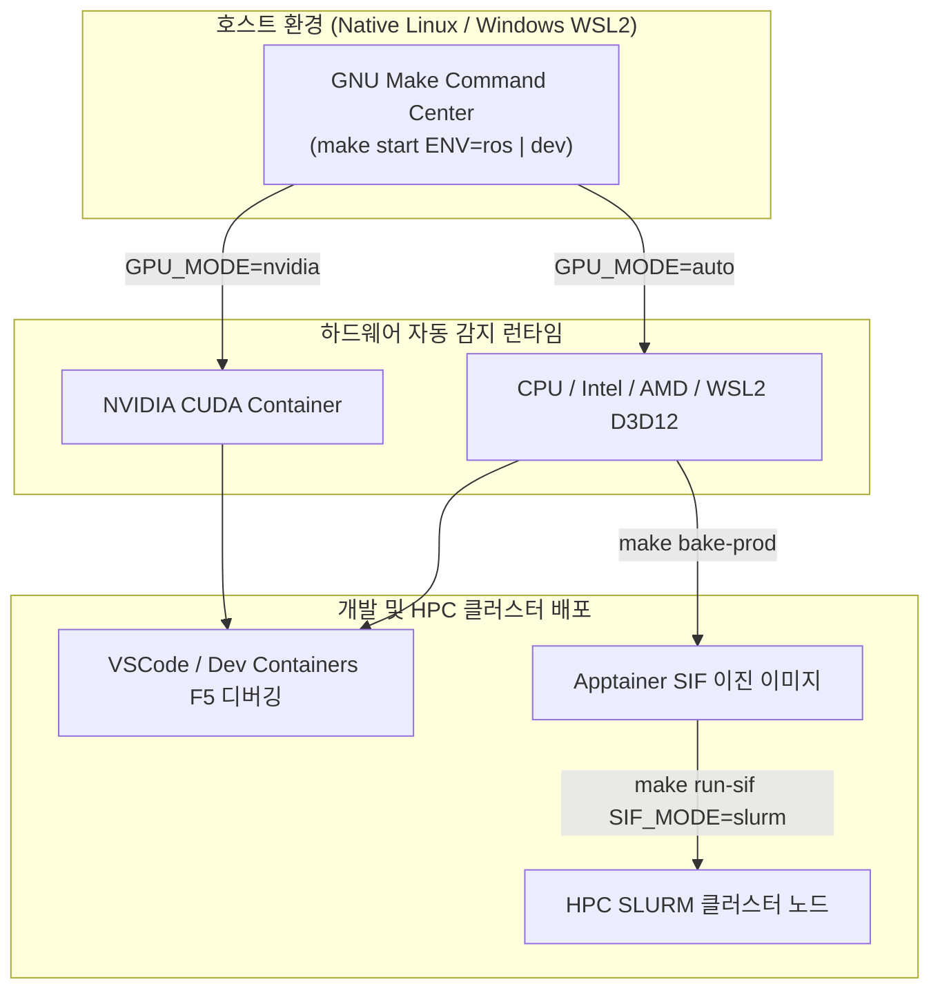

# 🚀 DevKit: 고성능 로보틱스 & C++/Python 통합 개발 환경

[](LICENSE)
[]()
[]()
[]()

> **TL;DR (3줄 요약)**
> - **DevKit**은 **Native Linux** 및 **Windows WSL2** 환경에서 ROS 1/2, Pure C++, Pure Python 개발을 한 번에 지원하는 워크스페이스 구축 툴킷입니다.
> - **GPU 하드웨어(NVIDIA, AMD, Intel, D3D12)를 자동 감지**하여 최적의 가속 환경을 구성하며, VSCode 디버깅(GDB, debugpy)이 사전 정의되어 있습니다.
> - 로컬 개발 환경을 단 한 줄의 명령으로 **HPC 클러스터(Apptainer SIF & SLURM)** 배치 작업으로 전환합니다.

---

## 📌 핵심 시스템 아키텍처



---

## ⚡ 1분 퀵스타트 (Quick Start)

### 1. ROS 2 / ROS 1 개발 환경 시작 (`ENV=ros`)
```bash
# 1) 도커 이미지 빌드 (GPU 자동 감지)
make build ENV=ros

# 2) 개발 컨테이너 기동
make start ENV=ros

# 3) 대화형 셸 진입
make shell ENV=ros
```

### 2. 순수 C++ / Python 개발 환경 시작 (`ENV=dev`)
```bash
make build ENV=dev && make start ENV=dev && make shell ENV=dev
```

> [!TIP]
> **터미널 명령어 자동 완성 설치**: 호스트에서 `make completion-install`을 한 번 실행하면 `make` 명령어 및 `ENV=`, `SIF_MODE=` 옵션 탭 자동 완성이 활성화됩니다.

---

## ⌨️ 자주 쓰는 필수 숏컷 (Essential Shortcuts)

컨테이너 내부 셸 진입 후 사용하는 주요 단축 명령어입니다.

| 명령 | 기능 및 설명 |
| :--- | :--- |
| **`h` / `help`** | 컨테이너 내부 전용 도움말 및 숏컷 안내 출력 |
| **`mksync`** | **원클릭 환경 동기화**: 파이썬 venv 생성 + 의존성 설치 + 빌드 일괄 수행 |
| **`cbuild`** | **ROS / C++ 빌드**: `colcon build --symlink-install` 실행 |
| **`mclean`** | **의존성 무손상 클린**: `build/`, `install/`, `devel/` 산출물만 정밀 삭제 |
| **`mkenv`** | **Python venv 생성**: `install/.venv` 경로에 `uv` 기반 isolated 가상환경 구축 |
| **`check_deps`** | **런타임 라이브러리 검사**: `install/` 내 누락된 `*.so` 라이브러리를 `ldd`로 탐지 |
| **`hw_check`** | **하드웨어 진단**: CPU, RAM, 네트워크, GPU, 디스플레이 통과 상태 스캔 |
| **`gpu status`** | **GPU 상태 점검**: 가동 중인 GPU 드라이버 및 렌더링 모드 검사 |

---

## 🎮 하드웨어 & GPU 지원 모드

`GPU_MODE` 환경변수를 통해 사용자의 하드웨어를 자동으로 감지합니다 (`.env` 제어 가능).

* **`GPU_MODE=auto`** (기본값): 시스템에 설치된 NVIDIA, Intel, AMD, WSL2 디바이스를 자동 감지하여 모드 선택.
* **`GPU_MODE=nvidia`**: NVIDIA CUDA Container Toolkit 기반 하드웨어 가속.
* **`GPU_MODE=igpu`**: Intel QSV / AMD ROCm 및 Linux `/dev/dri` 파스스루.
* **`GPU_MODE=cpu`**: GPU가 없는 환경이나 CI/CD 서버를 위한 LLVMpipe 소프트웨어 렌더링.

---

## 📖 상세 매뉴얼 및 문서 안내

자세한 기능 설명 및 고급 서버 배포법은 아래 전문 문서를 참조하세요:

* 📘 **[개발자 워크플로우 & 숏컷 상세 가이드 (docs/DEVELOPMENT.md)](docs/DEVELOPMENT.md)**
  * `mksync` 가동 순서, `pyproject.toml` 연동, 파이썬 패키지 관리 (`uv`), SIF 생성 옵션 상세.
* 🛰️ **[원격 서버 & SLURM 클러스터 배포 매뉴얼 (docs/SLURM.md)](docs/SLURM.md)**
  * Apptainer SIF 빌드 및 원격 서버 스토리지 분리 구조, `sbatch` 배치 작업 제출, 실시간 로그 모니터링.
* 🐞 **[디버깅 & 트러블슈팅 가이드 (docs/DEBUGGING.md)](docs/DEBUGGING.md)**
  * VSCode GDB/debugpy 디버거 세팅, X11/Wayland GUI 권한 문제 해결, `check_deps` 의존성 검사법.
