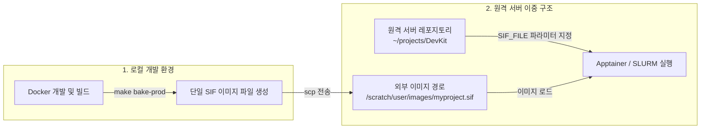
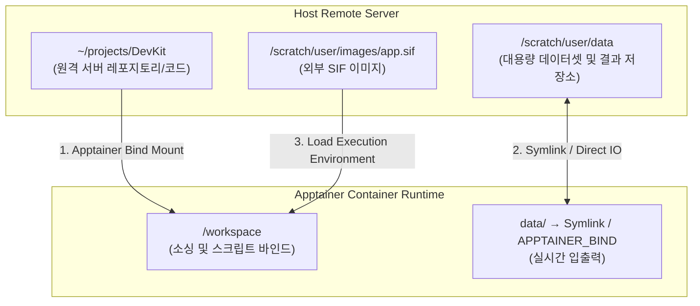

# 🛰️ 원격 서버 및 HPC 클러스터 배포 매뉴얼 (Apptainer & SLURM Guide)

본 문서는 보안 및 권한 정책으로 도커(Docker) 데몬 사용이 제한된 **원격 GPU 서버, 연구소 클러스터 및 HPC(High-Performance Computing) 환경**에서 DevKit 산출물을 안전하게 실행하고 배치(Batch) 작업을 투고하는 완전 가이드입니다.

---

## 📌 원격 서버 고정 배포 아키텍처 (Fixed Deployment Pattern)

본 프로젝트는 **원격 서버의 레포지토리 위치와 SIF 이미지 파일 위치가 상이하게 분리된 환경**을 고정 지원하도록 설계되었습니다.



### 🎯 디렉토리 분리 표준 규칙
1. **원격 서버 레포 위치**: `~/projects/DevKit` (소스 코드, 메이크파일 및 환경 설정 유지)
2. **원격 서버 SIF 이미지 위치**: `~/images/` 또는 `/scratch/user/images/` (레포 외부 대용량 이미지 스토리지)

---

## 1. 사전 준비 및 개념 이해

| 개념 | 설명 |
| :--- | :--- |
| **Apptainer (구 Singularity)** | 루트(root) 권한 없이 실행 가능한 HPC 표준 이식형 컨테이너 런타임입니다. |
| **SIF (Single Image Format)** | 워크스페이스, 라이브러리, 의존성이 하나의 압축 파일로 패키징된 단일 이진 이미지입니다. |
| **SLURM (Simple Linux Utility for Resource Management)** | 원격 서버 클러스터의 CPU/GPU 자원을 스케줄링하고 작업을 할당하는 배치 스케줄러입니다. |

### 🔄 바인드 마운트 및 입출력 구조



1. **소프트웨어 런타임 공급**: 외부 경로의 `.sif` 파일이 격리된 실행 환경을 공급합니다.
2. **레포지토리 마운트**: 원격 서버의 레포지토리(`~/projects/DevKit`)가 SIF 내부 `/workspace`로 바인드 마운트되어 동적 코드를 실행합니다.
3. **대용량 데이터 입출력 (Symlink & Bind)**: 대용량 데이터셋 및 체크포인트, 런타임 결과 파일은 레포 내부의 심볼릭 링크(예: `data -> /scratch/user/data`) 또는 `APPTAINER_BIND` 환경변수를 통해 서버 스토리지로 직접 입출력(Stream)됩니다.

---

## 2. 단계별 표준 워크플로우

### Step 1. 로컬 PC에서 프로덕션 SIF 이미지 굽기 (Bake)

로컬 개발 PC에서 개발 및 테스트가 완료되면, 운영 서버로 전송할 SIF 단일 이미지 파일을 생성합니다.

```bash
# ROS 프로덕션 SIF 이미지 생성 (권장)
make bake-prod ENV=ros

# Pure C++/Python 프로덕션 SIF 이미지 생성
make bake-prod ENV=dev

# Full CUDA 스택 포함 프로덕션 SIF 생성 (NVIDIA CUDA 라이브러리 풀패키지)
PROD_FULL_CUDA=1 make bake-prod ENV=ros
```
> 생성된 SIF 파일예시: `myproject_ros_prod_latest.sif`

> **의존성 동기화 실패 정책 (fail-open 스위치)**: 워크스페이스 의존성 동기화(`sync_deps` / `setup_sync_deps.sh`)는
> **기본적으로 실패 시 즉시 중단**됩니다 — 의존성이 누락된 이미지가 원격 클러스터에 배포되는 것을 막기 위함입니다.
> 오프라인·사설 레포 등으로 의도적으로 일부만 받고 진행해야 한다면 `DEVKIT_VCS_ALLOW_FAILURE=1`(서드파티 vcs) 또는
> `DEVKIT_ROSDEP_ALLOW_FAILURE=1`(rosdep)로 **fail-open**을 명시적으로 켜세요. 단, 이 경우 의존성이 빠진 SIF가
> 생성될 수 있으니 주의하세요. (상세: [`docs/DEVELOPMENT.md`](DEVELOPMENT.md))

---

### Step 2. 원격 서버 전용 이미지 디렉토리로 SIF 전송 (Transfer)

`scp` 또는 `rsync`를 이용하여 생성된 `.sif` 파일을 **원격 서버의 레포 외부 경로(예: `~/images/` 또는 `/scratch/user/images/`)**로 전송합니다.

```bash
# SIF 이미지를 원격 서버의 외부 이미지 스토리지 경로로 전송
scp myproject_ros_prod_latest.sif user@hpc.your-domain.com:/scratch/user/images/
```

---

### Step 3. 원격 서버 레포 위치에서 대화형/단독 실행 (Execution)

원격 서버의 **레포지토리 디렉토리(`~/projects/DevKit`)로 이동**한 후, `SIF_FILE` 경로 변수를 지정하여 실행합니다.

```bash
# 원격 서버 접속 및 레포 이동
ssh user@hpc.your-domain.com
cd ~/projects/DevKit

# 1) 간단한 일회성 명령 실행 (RUN_ARGS 활용)
SIF_FILE=/scratch/user/images/myproject_ros_prod_latest.sif make run-sif SIF_MODE=prod ENV=ros RUN_ARGS='python3 train.py'

# 2) 환경변수 기반 명령 지정 (APP_COMMAND 활용)
SIF_FILE=/scratch/user/images/myproject_ros_prod_latest.sif APP_COMMAND="python3 train.py" make run-sif SIF_MODE=prod ENV=ros

# 3) Direct apptainer 명령으로 실행 시
apptainer run --nv /scratch/user/images/myproject_ros_prod_latest.sif python3 train.py
```

---

### Step 4. SLURM 클러스터 배치 작업 투고 (SLURM Batch Submission)

원격 서버 레포지토리에서 외부 SIF 파일을 지정하여 SLURM 클러스터 노드로 배치 작업 제출:

```bash
cd ~/projects/DevKit

# 1) RUN_ARGS 축약형 구문으로 SLURM 작업 제출 (추천)
SIF_FILE=/scratch/user/images/myproject_ros_prod_latest.sif \
DEVKIT_SLURM_PARTITION=gpu \
DEVKIT_SLURM_GRES=gpu:1 \
DEVKIT_SLURM_CPUS=8 \
DEVKIT_SLURM_TIME=12:00:00 \
make run-sif SIF_MODE=slurm ENV=ros RUN_ARGS='python3 train.py --epochs 100'

# 2) APP_COMMAND 명시형 구문
SIF_FILE=/scratch/user/images/myproject_ros_prod_latest.sif \
DEVKIT_SLURM_PARTITION=gpu \
DEVKIT_SLURM_GRES=gpu:1 \
APP_COMMAND="python3 train.py --epochs 100" \
make run-sif SIF_MODE=slurm ENV=ros
```

---

### Step 5. SLURM 작업 상태 모니터링 및 로그 확인 (Monitoring & Logs)

#### 1) 작업 상태 조회 및 취소
```bash
# 현재 제출한 SLURM 작업 목록 조회 (squeue 연동)
make slurm-status

# 실행 중이거나 대기 중인 SLURM 작업 전체 취소 (scancel 연동)
make slurm-cancel
```

#### 2) 💡 SLURM 로그 출력 경로 및 실시간 모니터링 팁
SLURM 배치 작업의 모든 출력 로그는 레포지토리 내 **`logs/` 디렉토리 하위에 자동 생성**됩니다.

* **표준 출력 로그 경로**: `logs/<job_name>_<job_id>.out` (예: `logs/devkit_12345.out`)
* **표준 에러 로그 경로**: `logs/<job_name>_<job_id>.err` (예: `logs/devkit_12345.err`)

```bash
# 최신 SLURM 작업의 표준 출력 로그 실시간 팔로우
tail -f logs/*.out

# 최신 SLURM 작업의 에러 로그 실시간 모니터링
tail -f logs/*.err

# 특정 작업 ID(예: 12345) 로그 모니터링
tail -f logs/*_12345.out
```

---

## 3. 고급 서버 설정 및 주요 환경변수 참조

### 주요 환경변수 매핑 표

| 환경 변수 | 기본값 | 설명 |
| :--- | :--- | :--- |
| **`SIF_FILE`** | *(자동 감지)* | **원격 서버 내 SIF 이미지 파일 절대/상대 경로** (예: `/scratch/user/images/myproject.sif`) |
| **`SIF_MODE`** | `dev` | SIF 실행 대상 선택 (`dev`: 개발 셸, `prod`: 단독 실행, `slurm`: SLURM 배치 제출) |
| **`RUN_ARGS`** | *(없음)* | 컨테이너 내부 실행 명령 축약 인자 (예: `RUN_ARGS='python3 train.py'`) |
| **`APP_COMMAND`** | `python3 -V` | SIF 컨테이너 내부에서 실행할 수행 명령 (`RUN_ARGS` 지정 시 `RUN_ARGS` 우선) |
| **`DEVKIT_SLURM_PARTITION`** | `local` | 작업을 제출할 SLURM 파티션(큐) 이름 (`--partition`) |
| **`DEVKIT_SLURM_GRES`** | `gpu:1` | 요청할 GPU 제네릭 리소스 (`--gres`, 예: `gpu:a100:1` 또는 `gpu:2`) |
| **`DEVKIT_SLURM_CPUS_PER_TASK`** | `4` | 태스크당 CPU 코어 수 (`--cpus-per-task`) |
| **`DEVKIT_SLURM_NODES`** / **`DEVKIT_SLURM_NTASKS`** | `1` / `1` | 노드 수 / 태스크 수 (`--nodes` / `--ntasks`) |
| **`DEVKIT_SLURM_MEM`** | `32G` | 작업 메모리 (`--mem`, 예: `64G`) — 항상 지정됨(기본값은 `scripts/slurm_run.sh`의 `#SBATCH --mem`) |
| **`DEVKIT_SLURM_TIME`** | `00:30:00` | 최대 작업 허용 시간 (`--time`, `HH:MM:SS`) |
| **`DEVKIT_SLURM_JOB_NAME`** | `devkit` | 작업 이름 (`--job-name`; 로그 파일명 `%x`에 사용) |
| **`DEVKIT_SLURM_EXTRA_ARGS`** | *(없음)* | 위 목록에 없는 임의의 `sbatch` 플래그를 그대로 통과 (예: `--account=lab --qos=high --exclusive`) |

> **적용 우선순위**: 환경변수 > `scripts/slurm_run.sh`의 `#SBATCH` 지시자 > 기본값. `DEVKIT_SLURM_EXTRA_ARGS`는 관리 대상
> 인자 **뒤에** 추가되어 필요 시 이를 덮어쓸 수 있습니다. 단, 공백이 포함된 값은 지원하지 않으므로(단어 분할) 그런 경우
> `scripts/slurm_run.sh`의 `#SBATCH` 지시자를 직접 사용하세요.

> **예시 (보여주신 설정을 env만으로 재현)**:
> ```bash
> DEVKIT_SLURM_PARTITION=partition-3090-intel DEVKIT_SLURM_GRES=gpu:4 \
> DEVKIT_SLURM_CPUS_PER_TASK=8 DEVKIT_SLURM_MEM=32G \
> DEVKIT_SLURM_JOB_NAME=pluto_train_sanity \
> DEVKIT_SLURM_OUTPUT=/home/ailab/AILabDataset/slurm-logs/%x_%j.out \
> DEVKIT_SLURM_ERROR=/home/ailab/AILabDataset/slurm-logs/%x_%j.err \
> DEVKIT_SLURM_COMMENT=submitter:sangbum \
> APP_COMMAND="python3 train.py" make run-sif SIF_MODE=slurm ENV=ros
> ```

### 서버 공유 스토리지 바인드 마운트 (`APPTAINER_BIND`)
HPC 서버의 외부 공유 스토리지 폴더를 SIF 내부로 바인드 연결해야 하는 경우:

```bash
# /scratch 및 /global 공유 폴더를 SIF 내부 동일 경로로 마운트 실행
APPTAINER_BIND="/scratch:/scratch,/global:/global" \
SIF_FILE=/scratch/user/images/myproject_ros_prod_latest.sif \
make run-sif SIF_MODE=prod ENV=ros RUN_ARGS='python3 train.py'
```

---

## 4. 트러블슈팅 (Troubleshooting)

### Q1. `SIF not found: /path/to/sif` 오류가 발생합니다.
- `SIF_FILE` 경로에 지정한 절대 경로가 올바른지 파일 존재 여부를 확인하세요:
  ```bash
  ls -la /scratch/user/images/myproject_ros_prod_latest.sif
  ```

### Q2. `apptainer: command not found` 또는 `sbatch: command not found` 오류가 발생합니다.
- 서버 환경에 따라 모듈 로드가 필요합니다. 관리자에게 모듈 로드 명령을 문의하거나 실행하세요:
  ```bash
  module load apptainer   # 또는 module load singularity
  module load slurm
  ```

### Q3. GPU가 인식되지 않습니다 (`CUDA Available: False`).
- 실행 시 `--nv` (NVIDIA) 또는 `--rocm` (AMD) 플래그 지원 환경인지 확인하세요.
- SLURM 배치 제출 시 `DEVKIT_SLURM_GRES=gpu:1` 옵션이 누락되지 않았는지 확인하세요.

### Q4. SLURM 로그 파일이 보이지 않거나 생성이 되지 않습니다.
- 작업이 제출된 후 레포지토리 내 `logs/` 디렉토리가 자동으로 생성되었는지 확인하세요.
- `ls -la logs/` 명령으로 `<job_name>_<job_id>.out` 또는 `.err` 파일이 생성되고 있는지 점검하고 `tail -f logs/*.out`으로 확인하세요.
